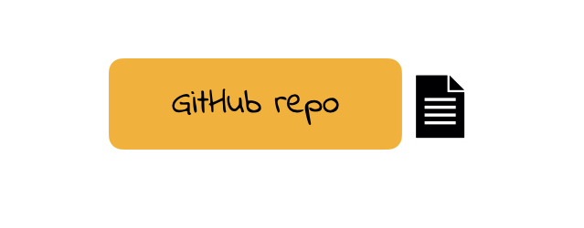
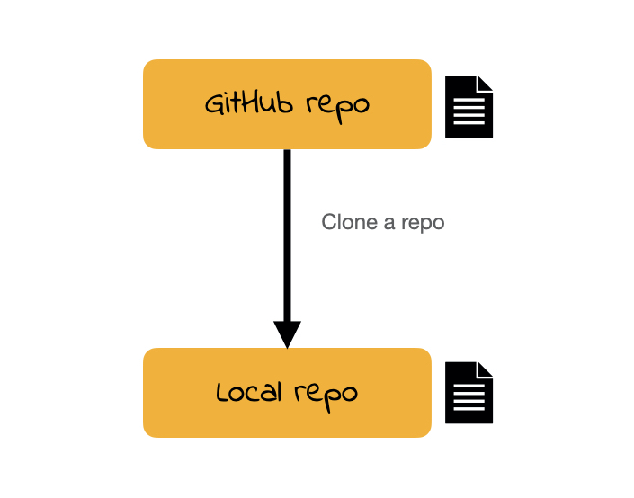
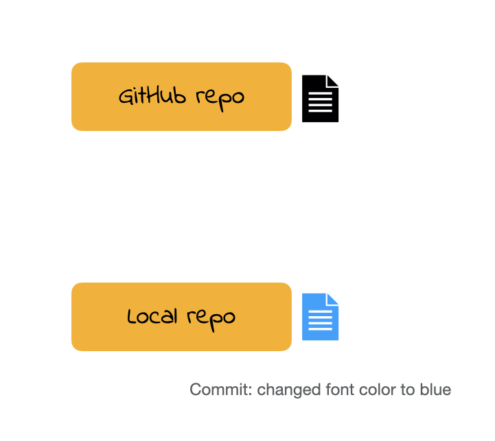
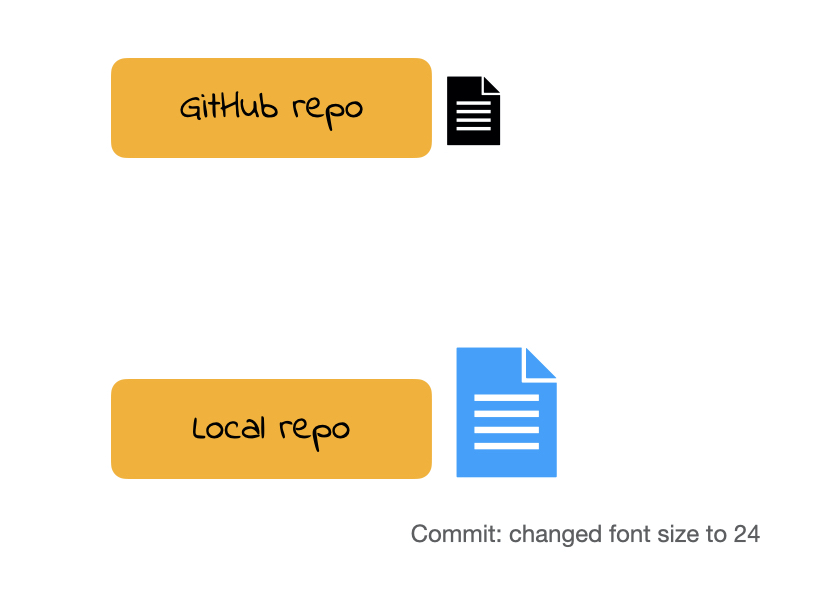
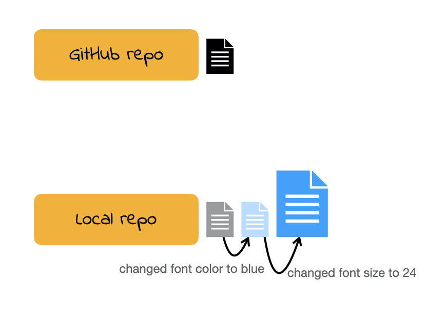
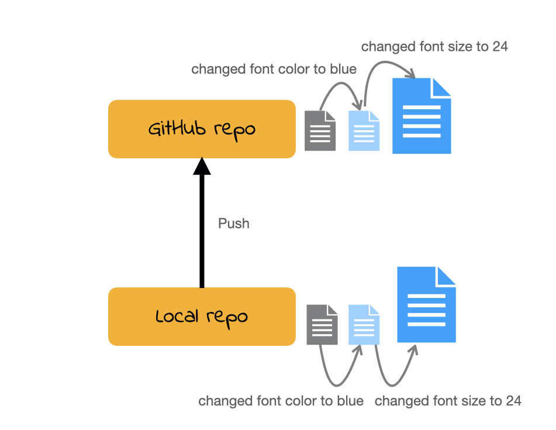
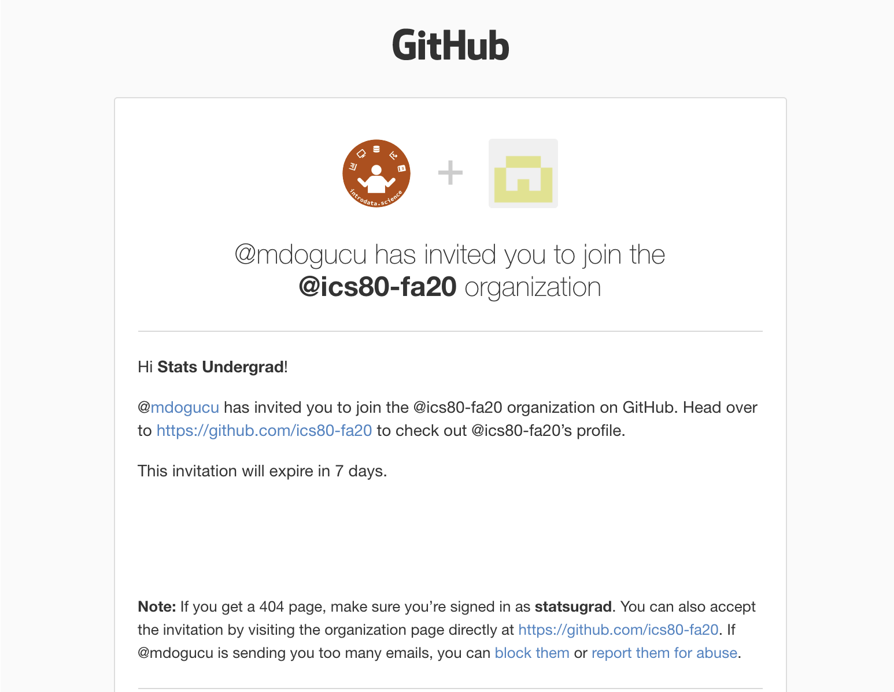

class: title-slide

```{r child = "../setup.Rmd"}
```

<br>
<br>
.right-panel[ 

# `r rmarkdown::metadata$title`
## `r rmarkdown::metadata$author`
]

---

## Goals

- Install git

- Introduce yourself to git

- Setup SSH key

- Use git with GitHub

---

class: middle


For the first three goals, we will use [Happy Git and GitHub for the useR](https://happygitwithr.com/)

---

class: center middle inverse

.font75[Goal 1: Install git]

---

class: center middle 

## Check to see if you already have git


<video width="80%" height="45%%" align = "center" controls>
  <source src="screencast/01d-check-git-install.mp4" type="video/mp4">
</video>


---

class: center middle

## Install git on Windows

[Git for Windows](https://gitforwindows.org/)

---

class: center middle

## Install git on Mac

<video width="80%" height="45%%" align = "center" controls>
  <source src="screencast/01e-mac-git-install.mp4" type="video/mp4">
</video>
---

class: center middle inverse

.font75[Goal 2: Introduce yourself to git]

---

class: center middle 

<video width="80%" height="45%%" align = "center" controls>
  <source src="screencast/01f-introduce-yourself.mp4" type="video/mp4">
</video>

---

class: center middle inverse

.font75[Goal 3: Setup SSH key]

---

class: center middle

<video width="80%" height="45%%" align = "center" controls>
  <source src="screencast/01g-github-ssh.mp4" type="video/mp4">
</video>

---

class: center middle inverse

.font75[Goal 4: Use git with GitHub]

---

class: inverse center middle 

.font75[version control]

---

hw1

--

hw1_final

--

hw1_final2

--

hw1_final3

--

hw1_finalwithfinalimages

--

hw1_finalestfinal

---

What if we tracked our file with a better names for each version and have only 1 file **hw1**?

--

hw1 **added questions 1 through 5**

--

hw1 **changed question 1 image**

--

hw1 **fixed typos**

--

We will call the descriptions in bold **commit** messages.

---

class: middle

## git vs. GitHub

- git allows us to keep track of different versions of a file(s).

- GitHub is a website where we can store (and share) different versions of the files. 

---

```{r echo=FALSE, out.width='40%',fig.align='center'}

```

---

```{r echo=FALSE, out.width='55%', fig.align='center'}

```

---

```{r echo=FALSE, out.width='55%', fig.align='center'}

```

---

```{r echo=FALSE, out.width='55%', fig.align='center'}

```

---

```{r echo=FALSE, out.width='55%', fig.align='center'}

```

---

```{r echo=FALSE, out.width='55%', fig.align='center'}

```

---

```{r echo=FALSE, out.width='100%'}

```

---


class: center middle

<video width="80%" height="45%%" align = "center" controls>
  <source src="screencast/01h-intro-github.mp4" type="video/mp4">
</video>


