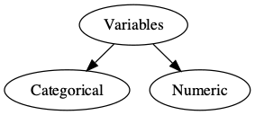

class: title-slide

```{r child = "../setup.Rmd"}
```

<br>
<br>
.right-panel[ 

# `r rmarkdown::metadata$title`
## `r rmarkdown::metadata$author`
]

---

```{r echo = FALSE, message=FALSE}
library(fivethirtyeight)
library(openintro)
library(tidyverse)
library(DiagrammeR)
library(DiagrammeRsvg)
library(rsvg)
```

## Variables

```{r echo=FALSE, out.width='100%'}
knitr::include_graphics('img/data-candy.png')
knitr::include_graphics('img/data-candy-tail.png')
```

---


```{r echo = FALSE, fig.align='center'}
diagram_small <- grViz("
    digraph {
        # graph aesthetics
        graph [ranksep = 0.3]
        # node definitions with substituted label text
        1 [label = 'Variables']
        2 [label = 'Categorical']
        3 [label = 'Numeric']
        
        # edge definitions with the node IDs
        1 -> 2
        1 -> 3
    }
")
tmp <- capture.output(rsvg_png(charToRaw(export_svg(diagram_small)),'img/diagram_small.png'))
 
```

---

## Variables

Variables `n_kids` (number of kids), `height`, and `winpercent` are __numerical variables__. 

--

We can do certain analyses using these variables such as finding an average `winpercent` or the maximum or minimum `winpercent`.

--

Not everything represented by numbers represents a numeric quantity. e.g. Student ID, cell phone number.

---

## Variables

Variables such as `chocolate`, `fruity`, and `class_year` (first-year, sophomore, junior, senior) are __categorical variables__. 

--

Categorical variables have __levels__. For instance `chocolate` and `fruity` both have two levels as `TRUE` and `FALSE` and `class_year` have four levels.

---


```{r}
glimpse(candy_rankings)
```

---

```{r}
glimpse(mariokart)
```

---
class: middle

`character`: takes string values (e.g. a person's name, address)  
--

`integer`: integer (single precision)  
--

`double`: floating decimal (double precision)   
--

`numeric`: integer or double  
--

`factor`: categorical variables with different levels  
--

`logical`: TRUE (1), FALSE (0)  

---
class: inverse middle

As a data scientist it is .font30[**your**] job to check the type(s) of data that you are working with. Do .font30[**not**]  assume you will work with clean data frames, with clean names, labels, and types.

---


```{r echo = FALSE}
library(titanic)
```

```{r}
glimpse(titanic_train)
```


